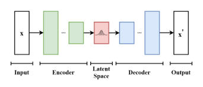

# Image Generation using Variational Autoencoders (VAE)

### This project uses variational autoencoders to generate images of MNIST dataset which are handwritten 0-9 digits. Our objective is to train the model and get 70% + accuracy for better results. This model helps to increase our idea of about neural networks which can be further used in GenAI (hot topic).

## What are variational autoencoders?

### Variational Autoencoders (VAEs) are a type of generative model that learns to model the underlying distribution of data in an unsupervised manner. The term autoencoder consists of two parts:
### 1. Encoder:  Maps input data (e.g., images, text, etc.) to a lower-dimensional latent space.
### 2. Decoder:  Reconstructs the input data from the latent space representation.

### The latent space is a compressed version of the data, where each point is a representation of the input. In VAEs, the latent space is stochastic, meaning the encoder outputs a probability distribution (typically Gaussian) rather than a single point.

## What is a convolutional layer?
### A convolutional layer is a core building block of Convolutional Neural Networks (CNNs), which are a class of deep learning models primarily used for processing grid-like data, such as images or time-series data. 
### It has three important features, kernel size, padding and stride. These features can be tuned to get better result.

### We use this convolutional layers in our encoder.
## Architecture of our Model

### In our case we have a 28 by 28 gray scale images (MNIST Dataset). Hence we use convolutional layer to reduce the size of these images into multiple channels.

